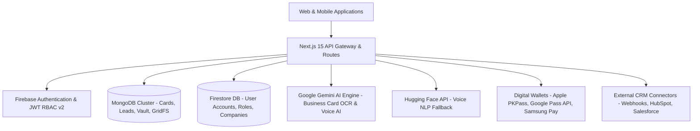
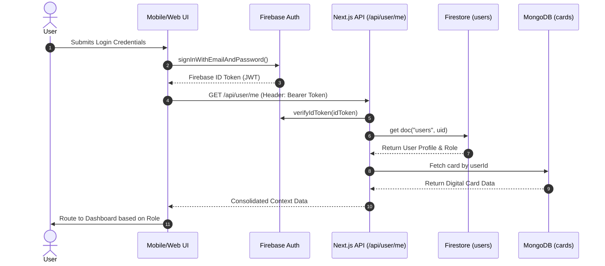

# MyCardShare / DBC Platform — Comprehensive System Architecture & Mobile App Specification Guide

> **Target File Location**: `public/Md files/work.md`  
> **Purpose**: Ultimate Technical Blueprint & Architectural Specification to build Native iOS & Android Mobile Applications (React Native / Flutter / Native Swift & Kotlin) fully compatible with the existing DBC Revamp Backend Infrastructure.

---

## 1. Executive System Overview & Technology Stack

The **DBC Platform (MyCardShare)** is an Enterprise-Grade Digital Business Card, Lead Generation, Contact Vault, and AI-Powered Networking Platform. It serves four distinct user classes: Individual Users, Corporate Employees, Enterprise/Brokerage Admins, and Platform Master Admins.



### Core Web Stack Breakdown
* **Framework**: Next.js 15 (App Router, React 19)
* **Styling**: Tailwind CSS v4, Framer Motion for micro-interactions
* **Primary Databases**:
  1. **MongoDB**: Stores Digital Card Data, Leads Captured, Contact Vault (Scanned Cards), GridFS binary images.
  2. **Firebase Firestore**: Manages Auth User Docs, Role Assignments (`roles.js`), Enterprise Company Workspaces, Voucher Codes, and Platform Metrics.
* **Authentication**: Firebase Auth (Email/Password, Google OAuth2) + Custom Bearer Token Middleware (`resolveUserContext`, `verifyFirebaseToken`).
* **AI & Engine Integration**:
  * **Google Gemini AI (`gemini-flash-latest`, `gemini-2.0-flash-lite`)**: Multi-modal Business Card OCR & Spoken Voice-to-Contact Extraction.
  * **Hugging Face (`Mistral-7B-Instruct`, `Phi-3-mini`)**: Open-source voice transcript NLP parsing fallback.
  * **Local Regex Engine**: Zero-network fallback for contact field extraction.
* **Digital Wallet Integrations**:
  * **Apple Wallet**: PassKit `.pkpass` generation.
  * **Google Wallet**: Google Wallet REST API & JWT pass signing.
  * **Samsung Wallet**: Samsung Pay pass registration.

---

## 2. Complete Page & Screen Inventory (Total: 47 Pages & Sub-screens)

Below is the exhaustive inventory of all 47 frontend pages and layouts, categorized into 6 major sections.

```
┌─────────────────────────────────────────────────────────────────────────┐
│                           PAGE INVENTORY SUMMARY                        │
├──────────────────────────────────┬──────────────────────────────────────┤
│ Section                          │ Total Pages / Screens                │
├──────────────────────────────────┼──────────────────────────────────────┤
│ A. Public & Marketing Pages      │ 10 Pages                             │
│ B. Authentication & Onboarding   │ 5 Pages / Interfaces                 │
│ C. Public Digital Card View      │ 1 Page (+ Modals)                    │
│ D. Individual User Portal        │ 12 Pages (`/portal/*`)               │
│ E. Enterprise Corporate Portal   │ 8 Pages (`/enterprise/*`)            │
│ F. Master Admin Portal           │ 11 Pages (`/master-admin/*`)         │
└──────────────────────────────────┴──────────────────────────────────────┘
```

---

### Section A: Public & Marketing Pages (10 Pages)

#### 1. Home / Landing Page (`/`)
* **File Path**: [src/app/page.jsx](file:///c:/Users/zuhaib/Downloads/Mycardshare-white%20theme/DBC_Revamp%20-%20Copy/src/app/page.jsx)
* **Target Audience**: Unauthenticated public visitors, prospective clients.
* **Purpose**: Primary marketing landing page showcasing digital card capabilities, corporate features, ROI calculator, and video demos.
* **Key UI Sections**:
  * **Hero Section**: Dynamic interactive preview of digital cards, call-to-action buttons ("Get Started", "Book Demo").
  * **Digital Section**: Features breakdown (NFC sharing, dynamic QR codes, instant lead capture).
  * **Intelligence Section**: AI scanner highlights (OCR + Voice AI).
  * **Audience Split**: Selector for Individual vs Enterprise solutions.
  * **Impact & Testimonials**: Statistics on paper card reduction and conversion rates.
  * **CTA & Footer Navigation**: Quick links to pricing, blog, contact, login/signup.
* **Connected APIs**: `/api/platform/stats` (public counter stats).
* **Mobile App Translation**: Landing onboarding carousel/splash screen upon first app install.

#### 2. About Us Page (`/about`)
* **File Path**: [src/app/about/page.jsx](file:///c:/Users/zuhaib/Downloads/Mycardshare-white%20theme/DBC_Revamp%20-%20Copy/src/app/about/page.jsx)
* **Purpose**: Company story, mission statement, sustainability impact, leadership team.
* **Mobile App Translation**: "About MyCardShare" menu option in Settings tab.

#### 3. Features Overview Page (`/features`)
* **File Path**: [src/app/features/page.jsx](file:///c:/Users/zuhaib/Downloads/Mycardshare-white%20theme/DBC_Revamp%20-%20Copy/src/app/features/page.jsx)
* **Purpose**: In-depth presentation of feature sets: Smart Cards, Team Workspace Management, AI Business Card Reader, CRM Integrations, Wallet Passes.
* **Mobile App Translation**: Feature highlight discovery cards in the mobile app drawer.

#### 4. Pricing Plans Page (`/pricing`)
* **File Path**: [src/app/pricing/page.jsx](file:///c:/Users/zuhaib/Downloads/Mycardshare-white%20theme/DBC_Revamp%20-%20Copy/src/app/pricing/page.jsx)
* **Purpose**: Transparent tier pricing breakdown (Individual Free, Individual Pro, Enterprise Team, Custom Brokerage).
* **Key Components**: Plan toggle (Monthly vs Annual), Feature comparison matrix, Enterprise custom request form.
* **Mobile App Translation**: In-App Purchase (IAP) Paywall screen (Apple App Store / Google Play Billing).

#### 5. Contact Us Page (`/contact`)
* **File Path**: [src/app/contact/page.jsx](file:///c:/Users/zuhaib/Downloads/Mycardshare-white%20theme/DBC_Revamp%20-%20Copy/src/app/contact/page.jsx)
* **Purpose**: Public contact form for inquiries, enterprise sales requests, support tickets.
* **Connected APIs**: Custom contact submission endpoint.

#### 6. Blog Listing Page (`/blog`)
* **File Path**: [src/app/blog/page.jsx](file:///c:/Users/zuhaib/Downloads/Mycardshare-white%20theme/DBC_Revamp%20-%20Copy/src/app/blog/page.jsx)
* **Purpose**: Articles, networking tips, digital transformation insights, search/filter bar.

#### 7. Blog Detail Page (`/blog/[slug]`)
* **File Path**: [src/app/blog/[slug]/page.jsx](file:///c:/Users/zuhaib/Downloads/Mycardshare-white%20theme/DBC_Revamp%20-%20Copy/src/app/blog/%5Bslug%5D/page.jsx)
* **Purpose**: Individual blog post reader, social sharing buttons, related articles widget.

#### 8. Privacy Policy Page (`/privacy`)
* **File Path**: [src/app/privacy/page.jsx](file:///c:/Users/zuhaib/Downloads/Mycardshare-white%20theme/DBC_Revamp%20-%20Copy/src/app/privacy/page.jsx)
* **Purpose**: GDPR / CCPA compliance, data retention details, privacy practices.

#### 9. Terms of Service Page (`/terms`)
* **File Path**: [src/app/terms/page.jsx](file:///c:/Users/zuhaib/Downloads/Mycardshare-white%20theme/DBC_Revamp%20-%20Copy/src/app/terms/page.jsx)
* **Purpose**: Service terms, subscription agreements, acceptable use policy.

#### 10. Enterprise Info Page (`/enterprise-info`)
* **File Path**: [src/app/enterprise-info/page.jsx](file:///c:/Users/zuhaib/Downloads/Mycardshare-white%20theme/DBC_Revamp%20-%20Copy/src/app/enterprise-info/page.jsx)
* **Purpose**: Specialized sales presentation page targeting large brokerages and corporate teams.

---

### Section B: Authentication & Onboarding (5 Pages/Flows)

#### 11. Login Page (`/login`)
* **File Path**: [src/app/login/page.jsx](file:///c:/Users/zuhaib/Downloads/Mycardshare-white%20theme/DBC_Revamp%20-%20Copy/src/app/login/page.jsx)
* **Purpose**: User login interface with role-based automatic navigation.
* **Key Features**:
  * Email & Password input fields.
  * Google OAuth Single-Sign-On (`signInWithPopup` / Google Identity).
  * Auto-fetching profile via `/api/user/me`.
  * **Role-Based Redirection Matrix**:
    * `isMasterAdmin` -> Redirects to `/master-admin/dashboard`
    * `isEnterprise` -> Redirects to `/enterprise/dashboard`
    * `isIndividual` / `isEmployee` -> Redirects to `/portal`
* **Mobile App Implementation**: Native Login view with Biometric Auth (FaceID / TouchID / Fingerprint) and Firebase Auth Native SDK.

#### 12. Sign-Up Page (`/signup`)
* **File Path**: [src/app/signup/page.jsx](file:///c:/Users/zuhaib/Downloads/Mycardshare-white%20theme/DBC_Revamp%20-%20Copy/src/app/signup/page.jsx)
* **Purpose**: Multi-tab registration hub for all user types.
* **Interfaces & Tabs**:
  1. **Individual Sign Up**: Full Name, Email, Password, direct setup of individual profile.
  2. **Enterprise / Brokerage Sign Up**: Company Name, Admin Email, Password, optional Voucher Code (validated via `/api/company/validate-voucher`). Creates pending company account for admin approval.
  3. **Join Workspace / Employee Sign Up**: User details + Workspace Invitation Code/Token (validated via `/api/invite/verify`).
* **Connected APIs**: `/api/company/create`, `/api/company/validate-voucher`, `/api/invite/verify`.

#### 13. Workspace Invite Acceptance Page (`/join-workspace`)
* **File Path**: [src/app/join-workspace/page.jsx](file:///c:/Users/zuhaib/Downloads/Mycardshare-white%20theme/DBC_Revamp%20-%20Copy/src/app/join-workspace/page.jsx)
* **Purpose**: Dedicated screen when an employee clicks an email invitation link containing `?code=XYZ123` or `?token=...`.
* **Flow**: Validates invite code -> autofills company context -> creates Firebase account -> links user to `companyId` with role `employee`.

#### 14. Onboarding Wizard Page (`/onboarding`)
* **File Path**: [src/app/onboarding/page.jsx](file:///c:/Users/zuhaib/Downloads/Mycardshare-white%20theme/DBC_Revamp%20-%20Copy/src/app/onboarding/page.jsx)
* **Purpose**: Post-registration initial setup wizard for new accounts.
* **Step-by-Step Flow**:
  * **Individual Flow**: Profile photo upload, job title, phone number, primary social links selection, initial template selection.
  * **Enterprise Flow**: Upload company logo, select corporate primary brand colors, set company website and address.
* **Connected APIs**: `/api/user/upload`, `/api/cards`, `/api/company`.

#### 15. Password Reset Page (`/reset-password`)
* **File Path**: [src/app/reset-password/page.jsx](file:///c:/Users/zuhaib/Downloads/Mycardshare-white%20theme/DBC_Revamp%20-%20Copy/src/app/reset-password/page.jsx)
* **Purpose**: Password recovery trigger sending reset emails via Firebase Authentication (`sendPasswordResetEmail`).

---

### Section C: Public Digital Card View (1 Page + Interactive Modals)

#### 16. Public Digital Business Card View (`/card/[slug]`)
* **File Path**: [src/app/card/[slug]/page.jsx](file:///c:/Users/zuhaib/Downloads/Mycardshare-white%20theme/DBC_Revamp%20-%20Copy/src/app/card/%5Bslug%5D/page.jsx) & [PublicCardView.jsx](file:///c:/Users/zuhaib/Downloads/Mycardshare-white%20theme/DBC_Revamp%20-%20Copy/src/components/card/PublicCardView.jsx)
* **Target Audience**: Anyone scanning an NFC card or QR code, or opening a profile link (`mycardshare.com/card/john-doe`).
* **Purpose**: Public dynamic landing card rendered for any user card or enterprise employee card.
* **Key Features & UI Modals**:
  1. **Card Header**: Banner image, profile avatar, company logo, employee verified badge.
  2. **Networking Status Badges**: Dynamic status pill showing status (e.g. "Actively Networking", "Open to Collaborations", "Looking for Co-founder", "Investor", "Building in Stealth").
  3. **Contact Info Section**: Full name, title, company, phone click-to-call, email click-to-email, location.
  4. **Social & Action Links Grid**: LinkedIn, Twitter/X, Instagram, GitHub, YouTube, WhatsApp, Website, Calendly, Facebook, Custom website buttons.
  5. **Save Contact Button (.vcf)**: Dynamically generates and downloads vCard 3.0 format file for instant address book import.
  6. **Exchange Contact / Lead Capture Modal**: Triggered when visitor taps "Exchange Contact". Form prompts for visitor Name, Email, Phone, Company, Notes. Submits directly to `/api/leads/create`.
  7. **Add to Digital Wallet**: Tapping "Add to Apple Wallet" calls `/api/wallet/apple`, "Add to Google Wallet" opens Google Wallet pass link.
  8. **Dynamic QR Code Modal**: Shows full-screen high-res QR code for offline scanning.
* **Connected APIs**: `/api/cards/public/[slug]`, `/api/leads/create`, `/api/wallet/apple`, `/api/wallet/google`.

---

### Section D: Individual User Portal (`/portal/*` - 12 Pages)

#### 17. Portal Root / Dashboard Switcher (`/portal`)
* **File Path**: [src/app/portal/page.jsx](file:///c:/Users/zuhaib/Downloads/Mycardshare-white%20theme/DBC_Revamp%20-%20Copy/src/app/portal/page.jsx)
* **Purpose**: Main entry point after login. Evaluates user role and renders either `IndividualDashboard`, `CorporateDashboard`, or redirects master admin to `/master-admin/dashboard`.
* **Key Widgets**: Card performance metrics, quick scan trigger button, recent leads overview, wallet pass status.

#### 18. Profile & Card Editor (`/portal/profile`)
* **File Path**: [src/app/portal/profile/page.jsx](file:///c:/Users/zuhaib/Downloads/Mycardshare-white%20theme/DBC_Revamp%20-%20Copy/src/app/portal/profile/page.jsx)
* **Purpose**: Live interactive digital card editor for the current user.
* **Key Features**:
  * Real-time phone mockup preview (split-screen layout).
  * Personal info editor: Name, job title, company name, bio, phone, email, website.
  * Image uploaders: Avatar photo, background cover banner image (`/api/user/upload`).
  * Custom links manager: Add, edit, reorder social links, websites, portfolios.
  * Brand & Color customization: Select theme color, card background style (unless locked by enterprise admin).
  * Custom Card Slug editor (e.g. `mycardshare.com/card/custom-alias`).
* **Connected APIs**: `/api/cards` (PATCH), `/api/user/me`, `/api/user/upload`.

#### 19. Contact Vault / Business Card Saver (`/portal/vault`)
* **File Path**: [src/app/portal/vault/page.jsx](file:///c:/Users/zuhaib/Downloads/Mycardshare-white%20theme/DBC_Revamp%20-%20Copy/src/app/portal/vault/page.jsx)
* **Purpose**: Digital Rolodex storing all business cards scanned by the user or saved connections.
* **Key Features**:
  * Grid / List view of saved business cards.
  * Search by name, company, title, or keywords.
  * Filter dropdown by date added, source (AI Scan, Voice, Manual).
  * View card image snapshot + extracted contact details.
  * Export contacts to CSV or vCard bundle.
* **Connected APIs**: `/api/vault` (GET, DELETE), `/api/scanned-contacts`.

#### 20. AI Business Card Scanner (`/portal/scanner`)
* **File Path**: [src/app/portal/scanner/page.jsx](file:///c:/Users/zuhaib/Downloads/Mycardshare-white%20theme/DBC_Revamp%20-%20Copy/src/app/portal/scanner/page.jsx)
* **Purpose**: High-precision AI-powered paper business card scanner & voice contact recorder.
* **Modes**:
  1. **Camera / Photo Scan**: Takes picture via webcam or file upload -> Sends base64 image to `/api/ocr/extract` -> Gemini Vision AI processes card -> Auto-fills fields for verification -> Saves to Vault (`/api/vault`).
  2. **Voice Record Scan**: User records audio describing a person ("Met John Doe from Acme Corp, phone 555-1234...") -> Audio sent to `/api/voice-extract` -> AI extracts structured JSON -> User reviews & saves.
* **Connected APIs**: `/api/ocr/extract`, `/api/voice-extract`, `/api/vault`.

#### 21. Individual Leads Management (`/portal/leads`)
* **File Path**: [src/app/portal/leads/page.jsx](file:///c:/Users/zuhaib/Downloads/Mycardshare-white%20theme/DBC_Revamp%20-%20Copy/src/app/portal/leads/page.jsx)
* **Purpose**: View and manage leads collected via the user's public digital card ("Exchange Contact" modal).
* **Key Features**:
  * Lead data table: Contact Name, Email, Phone, Date Captured, Notes.
  * Search and date filter.
  * Export to CSV / Excel button.
  * Status tag (New, Contacted, Qualified).
* **Connected APIs**: `/api/leads` (GET, PATCH, DELETE), `/api/leads/export`.

#### 22. User Analytics & Performance (`/portal/analytics`)
* **File Path**: [src/app/portal/analytics/page.jsx](file:///c:/Users/zuhaib/Downloads/Mycardshare-white%20theme/DBC_Revamp%20-%20Copy/src/app/portal/analytics/page.jsx)
* **Purpose**: Personal analytics dashboard displaying card engagement.
* **Key Metrics**: Total Card Views, Total Contact Downloads (.vcf), Link Clicks breakdown, QR Code Scans count, Daily/Weekly view trend graphs (Recharts).
* **Connected APIs**: `/api/user/stats`.

#### 23. Campaign Tracking (`/portal/campaign`)
* **File Path**: [src/app/portal/campaign/page.jsx](file:///c:/Users/zuhaib/Downloads/Mycardshare-white%20theme/DBC_Revamp%20-%20Copy/src/app/portal/campaign/page.jsx)
* **Purpose**: Personal marketing links manager for specific networking events, email signatures, or campaigns.
* **Connected APIs**: `/api/campaigns`.

#### 24. Integrations & Connectors (`/portal/connectors`)
* **File Path**: [src/app/portal/connectors/page.jsx](file:///c:/Users/zuhaib/Downloads/Mycardshare-white%20theme/DBC_Revamp%20-%20Copy/src/app/portal/connectors/page.jsx)
* **Purpose**: CRM connection manager for individual users.
* **Supported Connectors**: Zapier Webhook URL configuration, Google Contacts Sync, HubSpot / Salesforce direct push settings.
* **Connected APIs**: `/api/user/me` (PATCH updates `zapierWebhookUrl`).

#### 25. Account Settings (`/portal/settings`)
* **File Path**: [src/app/portal/settings/page.jsx](file:///c:/Users/zuhaib/Downloads/Mycardshare-white%20theme/DBC_Revamp%20-%20Copy/src/app/portal/settings/page.jsx)
* **Purpose**: User account configuration, email preferences, security.
* **Key Features**: Change password modal (`/api/profile/change-password`), notification toggles, delete account trigger.
* **Connected APIs**: `/api/profile/change-password`, `/api/user/me` (DELETE).

#### 26. Request Approvals Page (`/portal/approvals`)
* **File Path**: [src/app/portal/approvals/page.jsx](file:///c:/Users/zuhaib/Downloads/Mycardshare-white%20theme/DBC_Revamp%20-%20Copy/src/app/portal/approvals/page.jsx)
* **Purpose**: For employee users to view card field change requests submitted to their enterprise admin for approval.

#### 27. Associated Companies Page (`/portal/companies`)
* **File Path**: [src/app/portal/companies/page.jsx](file:///c:/Users/zuhaib/Downloads/Mycardshare-white%20theme/DBC_Revamp%20-%20Copy/src/app/portal/companies/page.jsx)
* **Purpose**: Displays company profile and workspace details for employees linked to an enterprise account.

#### 28. Team Workforce Overview (`/portal/workforce`)
* **File Path**: [src/app/portal/workforce/page.jsx](file:///c:/Users/zuhaib/Downloads/Mycardshare-white%20theme/DBC_Revamp%20-%20Copy/src/app/portal/workforce/page.jsx)
* **Purpose**: Limited workforce directory view for team members.

---

### Section E: Enterprise Corporate Portal (`/enterprise/*` - 8 Pages)

#### 29. Enterprise Corporate Dashboard (`/enterprise/dashboard`)
* **File Path**: [src/app/enterprise/dashboard/page.jsx](file:///c:/Users/zuhaib/Downloads/Mycardshare-white%20theme/DBC_Revamp%20-%20Copy/src/app/enterprise/dashboard/page.jsx)
* **Target Audience**: Corporate Admins, HR Directors, Brokerage Managers.
* **Purpose**: Command center for managing company-wide digital cards, team performance, and lead flow.
* **Key Widgets**: Active Employee Cards count, Total Enterprise Leads Captured, Card Views across company, Quick Employee Invite trigger, Top performing team members list.
* **Connected APIs**: `/api/company/stats`, `/api/enterprise/analytics`.

#### 30. Enterprise Workspace & Employee Directory (`/enterprise/workspace`)
* **File Path**: [src/app/enterprise/workspace/page.jsx](file:///c:/Users/zuhaib/Downloads/Mycardshare-white%20theme/DBC_Revamp%20-%20Copy/src/app/enterprise/workspace/page.jsx)
* **Purpose**: Central employee directory management.
* **Key Features**:
  * View all employees in table with photo, name, title, email, status (Active / Pending), and card link.
  * **Invite Employee Modal**: Single invite via email or generate reusable workspace invite link (`/api/company/[companyId]/invite`).
  * Bulk import employees via CSV.
  * Role assignment (Admin vs Employee).
  * Deactivate / remove employee from company.
* **Connected APIs**: `/api/company/[companyId]/employees`, `/api/company/[companyId]/invite`, `/api/enterprise/workspace`.

#### 31. Enterprise Leads & CRM Aggregator (`/enterprise/leads`)
* **File Path**: [src/app/enterprise/leads/page.jsx](file:///c:/Users/zuhaib/Downloads/Mycardshare-white%20theme/DBC_Revamp%20-%20Copy/src/app/enterprise/leads/page.jsx)
* **Purpose**: Master lead vault aggregating all leads captured by all employees across the entire company.
* **Key Features**:
  * Unified lead table with column for "Captured By Employee".
  * Advanced filtering by date range, specific employee, lead status.
  * **Export to CRM**: Export to CSV or trigger manual sync to corporate CRM.
  * Retry failed CRM webhooks log.
* **Connected APIs**: `/api/enterprise/leads`, `/api/leads/export`, `/api/leads/crm-logs`.

#### 32. Corporate Marketing Campaigns (`/enterprise/campaign`)
* **File Path**: [src/app/enterprise/campaign/page.jsx](file:///c:/Users/zuhaib/Downloads/Mycardshare-white%20theme/DBC_Revamp%20-%20Copy/src/app/enterprise/campaign/page.jsx)
* **Purpose**: Create company-wide marketing campaigns, tradeshow specific links, and unified QR codes.
* **Connected APIs**: `/api/campaigns`, `/api/campaigns/[campaignId]`.

#### 33. Enterprise Analytics & Reports (`/enterprise/analytics`)
* **File Path**: [src/app/enterprise/analytics/page.jsx](file:///c:/Users/zuhaib/Downloads/Mycardshare-white%20theme/DBC_Revamp%20-%20Copy/src/app/enterprise/analytics/page.jsx)
* **Purpose**: In-depth corporate networking analytics.
* **Metrics**: Leaderboard of top employees by card views and leads, geographic distribution of scans, card template performance comparison.
* **Connected APIs**: `/api/enterprise/analytics`.

#### 34. Enterprise Connectors & CRM Sync (`/enterprise/connectors`)
* **File Path**: [src/app/enterprise/connectors/page.jsx](file:///c:/Users/zuhaib/Downloads/Mycardshare-white%20theme/DBC_Revamp%20-%20Copy/src/app/enterprise/connectors/page.jsx)
* **Purpose**: Configure enterprise CRM webhooks (Zapier, Salesforce, HubSpot, Follow Up Boss) and auto-sync rules.
* **Connected APIs**: `/api/company/[companyId]`.

#### 35. Company Brand Profile & Templates (`/enterprise/profile`)
* **File Path**: [src/app/enterprise/profile/page.jsx](file:///c:/Users/zuhaib/Downloads/Mycardshare-white%20theme/DBC_Revamp%20-%20Copy/src/app/enterprise/profile/page.jsx)
* **Purpose**: Corporate branding control center.
* **Key Features**:
  * Upload master company logo and cover banner.
  * **Brand Color Lock**: Define primary corporate hex color and choose whether employees can customize their colors or must strictly follow company lock.
  * Default Card Template selection for new hires.
* **Connected APIs**: `/api/enterprise/profile`, `/api/company/upload`.

#### 36. Enterprise Settings & Billing (`/enterprise/settings`)
* **File Path**: [src/app/enterprise/settings/page.jsx](file:///c:/Users/zuhaib/Downloads/Mycardshare-white%20theme/DBC_Revamp%20-%20Copy/src/app/enterprise/settings/page.jsx)
* **Purpose**: Manage enterprise workspace name, plan tier, billing info, seats limit, custom domain.
* **Connected APIs**: `/api/company/[companyId]`.

---

### Section F: Master Admin Portal (`/master-admin/*` - 11 Pages)

#### 37. Master Admin Dashboard (`/master-admin/dashboard`)
* **File Path**: [src/app/master-admin/dashboard/page.jsx](file:///c:/Users/zuhaib/Downloads/Mycardshare-white%20theme/DBC_Revamp%20-%20Copy/src/app/master-admin/dashboard/page.jsx)
* **Target Audience**: Platform Super Admins (`admin@pentcloud.me`).
* **Purpose**: Platform-wide metrics, system health, revenue trends, global user counts.
* **Connected APIs**: `/api/platform/dashboard`, `/api/platform/stats`.

#### 38. Company Management (`/master-admin/company`)
* **File Path**: [src/app/master-admin/company/page.jsx](file:///c:/Users/zuhaib/Downloads/Mycardshare-white%20theme/DBC_Revamp%20-%20Copy/src/app/master-admin/company/page.jsx)
* **Purpose**: View and manage all registered companies/brokerages on the platform.
* **Connected APIs**: `/api/platform/companies`.

#### 39. Specific Company Controller (`/master-admin/company/[companyId]`)
* **File Path**: [src/app/master-admin/company/[companyId]/page.jsx](file:///c:/Users/zuhaib/Downloads/Mycardshare-white%20theme/DBC_Revamp%20-%20Copy/src/app/master-admin/company/%5BcompanyId%5D/page.jsx)
* **Purpose**: Detailed management of a specific enterprise client (override seats, extend subscription, suspend company).
* **Connected APIs**: `/api/platform/companies/[companyId]`, `/api/platform/companies/[companyId]/suspend`.

#### 40. Company Pending Approvals (`/master-admin/approval`)
* **File Path**: [src/app/master-admin/approval/page.jsx](file:///c:/Users/zuhaib/Downloads/Mycardshare-white%20theme/DBC_Revamp%20-%20Copy/src/app/master-admin/approval/page.jsx)
* **Purpose**: Review and approve/reject newly registered enterprise accounts and custom voucher registrations.
* **Connected APIs**: `/api/platform/companies/pending`, `/api/platform/companies/[companyId]/approval`.

#### 41. Individual Users Directory (`/master-admin/individuals`)
* **File Path**: [src/app/master-admin/individuals/page.jsx](file:///c:/Users/zuhaib/Downloads/Mycardshare-white%20theme/DBC_Revamp%20-%20Copy/src/app/master-admin/individuals/page.jsx)
* **Purpose**: Searchable table of all individual platform users, edit roles, deactivate users.
* **Connected APIs**: `/api/platform/individuals`, `/api/platform/individuals/[userId]`.

#### 42. Platform Lead Audit Logs (`/master-admin/leads`)
* **File Path**: [src/app/master-admin/leads/page.jsx](file:///c:/Users/zuhaib/Downloads/Mycardshare-white%20theme/DBC_Revamp%20-%20Copy/src/app/master-admin/leads/page.jsx)
* **Purpose**: System-wide lead flow monitoring and delivery error logs.
* **Connected APIs**: `/api/platform/leads`.

#### 43. Global Campaigns (`/master-admin/campaign`)
* **File Path**: [src/app/master-admin/campaign/page.jsx](file:///c:/Users/zuhaib/Downloads/Mycardshare-white%20theme/DBC_Revamp%20-%20Copy/src/app/master-admin/campaign/page.jsx)
* **Purpose**: Platform-wide marketing campaign administration.
* **Connected APIs**: `/api/platform/campaigns`.

#### 44. Platform Usage Analytics (`/master-admin/analytics`)
* **File Path**: [src/app/master-admin/analytics/page.jsx](file:///c:/Users/zuhaib/Downloads/Mycardshare-white%20theme/DBC_Revamp%20-%20Copy/src/app/master-admin/analytics/page.jsx)
* **Purpose**: Macro analytics on card views, AI scans completed, storage consumption.

#### 45. Platform Workspaces (`/master-admin/workspace`)
* **File Path**: [src/app/master-admin/workspace/page.jsx](file:///c:/Users/zuhaib/Downloads/Mycardshare-white%20theme/DBC_Revamp%20-%20Copy/src/app/master-admin/workspace/page.jsx)
* **Purpose**: Workspace allocation and multi-tenant domain mapping.
* **Connected APIs**: `/api/platform/workspaces`.

#### 46. Admin Profile (`/master-admin/profile`)
* **File Path**: [src/app/master-admin/profile/page.jsx](file:///c:/Users/zuhaib/Downloads/Mycardshare-white%20theme/DBC_Revamp%20-%20Copy/src/app/master-admin/profile/page.jsx)
* **Purpose**: Super admin profile settings.

#### 47. Platform System Settings (`/master-admin/settings`)
* **File Path**: [src/app/master-admin/settings/page.jsx](file:///c:/Users/zuhaib/Downloads/Mycardshare-white%20theme/DBC_Revamp%20-%20Copy/src/app/master-admin/settings/page.jsx)
* **Purpose**: Global API key manager (Gemini key, Firebase Admin key, HuggingFace key), Super-admin accounts list.
* **Connected APIs**: `/api/platform/super-admins`.

---

## 3. Authentication, Sign-Up & Onboarding Architecture

### Authorization Roles Matrix (`src/lib/roles.js`)
* **`master-admin` / `super_admin`**: Full platform access. Can view/manage all companies, users, leads, and system configs.
* **`enterprise` / `admin`**: Corporate Company Admin. Manages company branding, workspace employees, CRM integrations, and team leads.
* **`employee`**: Corporate Team Member. Has digital business card governed by company branding lock, can view own card analytics and scanned vault.
* **`individual` / `standard`**: Free or Pro personal user. Has full control over card design and personal contacts vault.



---

### Detailed Sign-Up Interfaces & Flows

#### Flow 1: Individual Registration (`/signup?tab=individual`)
1. User provides `fullName`, `email`, `password`.
2. App creates Firebase Auth user (`createUserWithEmailAndPassword`).
3. App writes Firestore user document in `users` collection:
   ```json
   {
     "uid": "FIREBASE_UID",
     "email": "user@example.com",
     "fullName": "John Doe",
     "role": "individual",
     "status": "active",
     "createdAt": "TIMESTAMP"
   }
   ```
4. App initializes empty Digital Business Card document in MongoDB `cards` collection.
5. User is redirected to `/onboarding`.

#### Flow 2: Enterprise / Brokerage Registration (`/signup?tab=enterprise`)
1. User provides `companyName`, `adminName`, `email`, `password`, and optional `voucherCode`.
2. If `voucherCode` is provided, frontend invokes `POST /api/company/validate-voucher` to check discount / pre-approved enterprise tier.
3. App creates Firebase Auth user for Company Admin.
4. App calls `POST /api/company/create` which creates:
   - Firestore `companies` document:
     ```json
     {
       "companyId": "comp_12345",
       "companyName": "Acme Brokerage",
       "adminUid": "FIREBASE_UID",
       "status": "pending", // Requires Master Admin approval unless valid voucher used
       "brandColor": "#0052FF",
       "employeeLimit": 50,
       "createdAt": "TIMESTAMP"
     }
     ```
   - Firestore `users` document with role `"enterprise"`.
5. User sees "Registration Pending Approval" screen or enters enterprise onboarding.

#### Flow 3: Join Workspace / Employee Registration (`/signup?tab=workspace` & `/join-workspace`)
1. Employee receives invite link containing invitation code/token.
2. App calls `POST /api/invite/verify` with `{ inviteCode }` to retrieve target `companyId` and company branding.
3. Employee completes registration form (Name, Password).
4. System creates Firebase user and sets Firestore document:
   ```json
   {
     "uid": "EMPLOYEE_UID",
     "email": "employee@acme.com",
     "companyId": "comp_12345",
     "role": "employee",
     "status": "active"
   }
   ```
5. MongoDB `cards` document automatically created with pre-applied company banner, logo, and brand color lock.

---

## 4. Database Schemas & Data Models

### 1. Card Model (`cards` collection in MongoDB)

```javascript
{
  "_id": ObjectId("65e..."),
  "userId": "FIREBASE_USER_UID",          // Indexed (unique)
  "cardSlug": "john-doe",                 // Indexed (sparse, unique)
  "companyId": "comp_12345",              // Optional link to Enterprise
  "workspaceId": "comp_12345",
  "fullName": "John Doe",
  "jobTitle": "Senior Commercial Broker",
  "companyName": "Acme Realty Group",
  "bio": "Specializing in commercial office spaces and retail leasing.",
  "email": "john.doe@acmerealty.com",
  "phone": "+1-555-0199",
  "phone2": "+1-555-0198",
  "website": "https://acmerealty.com",
  "address": "100 Financial Plaza, Suite 400, New York, NY",
  "avatarUrl": "https://storage.googleapis.com/.../avatar.jpg",
  "bannerUrl": "https://storage.googleapis.com/.../banner.jpg",
  "companyLogo": "https://storage.googleapis.com/.../logo.png",
  
  // Design & Branding Properties
  "themeColor": "#0A84FF",
  "templateStyle": "modern_glass",       // "modern_glass", "minimal_dark", "corporate_clean"
  "isColorLocked": true,                 // Set by Enterprise Admin
  "userStatus": "Actively Networking",    // Custom Badge status
  
  // Custom Social & Action Links
  "socialLinks": [
    { "id": "1", "platform": "linkedin", "url": "https://linkedin.com/in/johndoe", "label": "LinkedIn" },
    { "id": "2", "platform": "whatsapp", "url": "https://wa.me/15550199", "label": "WhatsApp Direct" },
    { "id": "3", "platform": "custom", "url": "https://acmerealty.com/listings", "label": "View Listings" }
  ],
  
  // Lead Exchange Modal Settings
  "leadFormConfig": {
    "title": "Exchange Contact Info",
    "requireCompany": true,
    "requireNotes": false,
    "customQuestions": ["Budget range?", "Timeline?"]
  },
  
  // Digital Wallet Passes Keys
  "appleWalletPassUrl": "/api/wallet/apple?cardId=...",
  "googleWalletPassUrl": "https://pay.google.com/gp/v/save/...",
  
  "views": 1420,
  "shares": 310,
  "createdAt": ISODate("2026-01-15T10:00:00Z"),
  "updatedAt": ISODate("2026-09-17T11:00:00Z")
}
```

---

### 2. Company Model (`companies` collection in Firestore / MongoDB)

```javascript
{
  "_id": "comp_12345",
  "companyName": "Acme Realty Group",
  "slug": "acme-realty",
  "adminUid": "FIREBASE_ADMIN_UID",
  "companyLogo": "/uploads/company_logo_123.png",
  "companyBanner": "/uploads/company_banner_123.png",
  "brandColor": "#0052FF",
  "isColorLocked": true,
  "status": "active",                     // "pending", "active", "suspended", "expired"
  "subscriptionPlan": "enterprise_pro",
  "subscriptionEndDate": ISODate("2027-12-31T23:59:59Z"),
  "employeeLimit": 100,
  "activeEmployeeCount": 34,
  
  // Integration Settings
  "isIntegrationEnabled": true,
  "zapierWebhookUrl": "https://hooks.zapier.com/hooks/catch/123/abc/",
  "hubspotApiKey": "encrypted_key",
  "salesforceInstanceUrl": "https://acme.my.salesforce.com",
  
  "createdAt": ISODate("2026-01-01T00:00:00Z")
}
```

---

### 3. Lead Model (`leads` collection in MongoDB)

```javascript
{
  "_id": ObjectId("66f..."),
  "cardId": "65e...",                     // Card where lead was captured
  "userId": "FIREBASE_CARD_OWNER_UID",    // Owner of the card
  "companyId": "comp_12345",              // Indexed
  "fullName": "Sarah Jenkins",
  "email": "sarah.j@prospectivebuyer.com",
  "mobile": "+1-555-9876",                 // Indexed
  "company": "Jenkins Logistics",
  "notes": "Interested in 10,000 sq ft warehouse space.",
  "capturedVia": "public_card_form",      // "public_card_form", "ocr_scan", "voice_ai"
  
  // CRM Dispatch Status
  "crmSyncStatus": "synced",              // "pending", "synced", "failed"
  "crmSyncLogs": [
    { "timestamp": ISODate("..."), "endpoint": "Zapier Webhook", "responseCode": 200 }
  ],
  
  "createdAt": ISODate("2026-09-17T11:15:00Z")
}
```

---

### 4. Scanned Contact Vault Model (`vault` collection in MongoDB)

```javascript
{
  "_id": ObjectId("67a..."),
  "userId": "FIREBASE_USER_UID",          // Owner who scanned the card
  "fullName": "Robert Chen",
  "jobTitle": "Managing Director",
  "company": "Apex Global Ventures",
  "email": "r.chen@apexglobal.com",
  "phone": "+1-555-4321",
  "phone2": "",
  "website": "https://apexglobal.com",
  "address": "500 California St, San Francisco, CA",
  "notes": "Met at TechExpo 2026. Interested in partnership.",
  "cardImageUrl": "/api/images/gridfs_image_id_789",
  "voiceAudioUrl": "/api/images/gridfs_audio_id_456",
  "scanConfidence": 0.94,
  "source": "ocr_gemini",                 // "ocr_gemini", "voice_ai", "manual"
  "createdAt": ISODate("2026-09-17T10:30:00Z")
}
```

---

## 5. Complete API Endpoint Directory (56 Endpoints)

| HTTP Method | API Path | Authorization Required | Request Body / Params | Description & Feature Used For |
| :--- | :--- | :--- | :--- | :--- |
| **GET** | `/api/user/me` | Bearer Token | - | Fetches authenticated user profile, role, company branding context. |
| **PATCH** | `/api/user/me` | Bearer Token | `{ fullName, bio, avatarUrl, ... }` | Updates current user's profile metadata. |
| **DELETE** | `/api/user/me` | Bearer Token | - | Deletes user account and associated card. |
| **POST** | `/api/user/upload` | Bearer Token | `multipart/form-data (file)` | Uploads avatar photo or cover image to Firebase Storage / Local GridFS. |
| **GET** | `/api/user/stats` | Bearer Token | - | Retrieves personal analytics (card views, shares, lead counts). |
| **POST** | `/api/profile/change-password`| Bearer Token | `{ currentPassword, newPassword }` | Changes password securely. |
| **GET** | `/api/cards` | Bearer Token | - | Retrieves digital business card owned by current user. |
| **PATCH** | `/api/cards` | Bearer Token | `{ fullName, jobTitle, socialLinks, themeColor, ... }` | Creates or updates current user's digital business card in MongoDB. |
| **DELETE** | `/api/cards` | Bearer Token | - | Deletes digital business card. |
| **GET** | `/api/cards/public/[slug]` | None (Public) | URL Param: `slug` | Public endpoint to fetch card by slug or userId for card rendering. |
| **GET** | `/api/cards/user/[userId]` | Bearer Token | URL Param: `userId` | Admin or internal lookup for specific user's card. |
| **POST** | `/api/ocr/extract` | Bearer Token | `{ image: "base64..." }` | AI Business Card Scanner: sends image to Gemini Vision API for OCR. |
| **POST** | `/api/voice-extract` | Bearer Token | `FormData(audio, transcript)` | Voice AI Scanner: processes voice audio/transcript into structured contact JSON. |
| **GET** | `/api/vault` | Bearer Token | Query: `?search=&page=` | Lists all scanned cards in user's Contact Vault. |
| **POST** | `/api/vault` | Bearer Token | `{ fullName, email, phone, company, ... }` | Saves new scanned card entry to vault. |
| **DELETE** | `/api/vault` | Bearer Token | Query: `?id=...` | Deletes entry from Contact Vault. |
| **GET** | `/api/scanned-contacts` | Bearer Token | - | Retrieve scanned contacts list. |
| **GET** | `/api/leads` | Bearer Token | Query: `?status=&search=` | Lists leads captured via user's or company's digital cards. |
| **POST** | `/api/leads/create` | None (Public) | `{ cardId, fullName, email, mobile, company, notes }` | Lead exchange form submission from public digital card page. |
| **GET** | `/api/leads/[leadId]` | Bearer Token | URL Param: `leadId` | Retrieves single lead detail. |
| **DELETE** | `/api/leads/[leadId]` | Bearer Token | URL Param: `leadId` | Deletes specific lead. |
| **GET** | `/api/leads/export` | Bearer Token | Query: `?format=csv` | Exports leads to downloadable CSV format file. |
| **GET** | `/api/leads/crm-logs` | Bearer Token | - | Views CRM webhook delivery audit logs and failed retries. |
| **POST** | `/api/company/create` | Bearer Token | `{ companyName, brandColor, ... }` | Registers new enterprise company profile. |
| **POST** | `/api/company/validate-voucher`| None | `{ voucherCode }` | Validates promotional or enterprise voucher code. |
| **POST** | `/api/company/upload` | Bearer Token | `FormData(file)` | Uploads corporate company logo or banner image. |
| **GET** | `/api/company/stats` | Bearer Token | - | Retrieves enterprise analytics summary (total cards, leads). |
| **GET** | `/api/company/[companyId]` | Bearer Token | URL Param: `companyId` | Fetches corporate workspace details. |
| **PATCH** | `/api/company/[companyId]` | Enterprise Admin | URL Param: `companyId` | Updates company branding lock, logo, webhook settings. |
| **GET** | `/api/company/[companyId]/employees`| Enterprise Admin | URL Param: `companyId` | Lists all employees in company workspace. |
| **POST** | `/api/company/[companyId]/invite` | Enterprise Admin | `{ email, role }` | Generates employee invite link or sends email invite. |
| **POST** | `/api/invite/verify` | None | `{ inviteCode }` | Verifies employee invitation token before registration. |
| **GET** | `/api/enterprise/analytics` | Enterprise Admin | - | Fetches company-wide analytics and top employee performance. |
| **GET** | `/api/enterprise/leads` | Enterprise Admin | - | Aggregates all leads captured by all workspace employees. |
| **GET** | `/api/enterprise/workspace` | Enterprise Admin | - | Workspace management stats. |
| **GET** | `/api/platform/dashboard` | Master Admin | - | Master Admin platform dashboard metrics. |
| **GET** | `/api/platform/stats` | Master Admin | - | System-wide statistics. |
| **GET** | `/api/platform/companies` | Master Admin | - | Lists all registered companies on platform. |
| **GET** | `/api/platform/companies/pending` | Master Admin | - | Lists enterprise accounts awaiting approval. |
| **POST** | `/api/platform/companies/[companyId]/approval`| Master Admin| `{ approved: true/false }` | Approves or rejects pending enterprise registration. |
| **POST** | `/api/platform/companies/[companyId]/suspend`| Master Admin | `{ suspended: true/false }` | Suspends or unsuspends company account. |
| **GET** | `/api/platform/individuals` | Master Admin | - | Directory of all individual users on platform. |
| **GET** | `/api/platform/leads` | Master Admin | - | Platform-wide lead audit log. |
| **GET** | `/api/platform/super-admins` | Master Admin | - | System super admins list. |
| **GET** | `/api/wallet/apple` | None (Public) | Query: `?cardId=...` | Generates and streams Apple Wallet `.pkpass` binary file. |
| **GET** | `/api/wallet/google` | None (Public) | Query: `?cardId=...` | Generates signed Google Wallet pass JWT URL. |
| **GET** | `/api/wallet/samsung/[[...params]]`| None (Public) | URL Params | Samsung Wallet pass registration integration. |
| **GET** | `/api/images/[id]` | None (Public) | URL Param: `id` | Serves binary image files stored in MongoDB GridFS. |
| **GET** | `/api/storage/[type]` | Bearer Token | URL Param: `type` | Local file storage management endpoint. |

---

## 6. Advanced Micro-Features & Engine Specifications

### 1. Networking Status Badges System
Cards support a dynamic status badge rendered at the top of the profile card:
* **Pre-defined Badges & Color Codes**:
  * `Actively Networking` -> Emerald Green (`#10b981`)
  * `Open to Collaborations` -> Sky Blue (`#38bdf8`)
  * `Available for Hire` -> Amber (`#fbbf24`)
  * `Looking for Co-founder` -> Purple (`#c084fc`)
  * `Open to Freelance` -> Teal (`#2dd4bf`)
  * `Seeking Mentorship` -> Orange (`#fb923c`)
  * `Offering Mentorship` -> Indigo (`#818cf8`)
  * `Open to Speaking` -> Rose (`#fb7185`)
  * `Investor` -> Yellow (`#facc15`)
  * `Building in Stealth` -> Slate Gray (`#94a3b8`)

### 2. Social Media URL Resolvers & Normalizer
When a user enters a handle or raw username (e.g. `@johndoe` or `+15550199`), the system normalizes it into a fully qualified URL:
* `linkedin` -> `https://linkedin.com/in/{handle}`
* `twitter` -> `https://x.com/{handle}`
* `instagram` -> `https://instagram.com/{handle}`
* `github` -> `https://github.com/{handle}`
* `youtube` -> `https://youtube.com/@{handle}`
* `whatsapp` -> `https://wa.me/{phone_digits}`
* `calendly` -> `https://calendly.com/{handle}`
* `facebook` -> `https://facebook.com/{handle}`

### 3. vCard 3.0 Generation Logic (.vcf Format)
When a visitor taps "Save Contact", the app constructs a vCard string in `text/vcard` format:
```
BEGIN:VCARD
VERSION:3.0
N:Doe;John;;;
FN:John Doe
ORG:Acme Realty Group
TITLE:Senior Commercial Broker
TEL;TYPE=CELL,VOICE:+1-555-0199
EMAIL;TYPE=WORK,INTERNET:john.doe@acmerealty.com
URL:https://acmerealty.com
NOTE:Specializing in commercial office spaces.
END:VCARD
```

---

## 7. Environment Variables & System Configuration Reference

The following environment variables are configured in `.env` and MUST be configured in your backend / API server:

```ini
# Database Connections
MONGODB_URI=mongodb+srv://.../business_cards?retryWrites=true&w=majority

# Security & JWT Token
JWT_SECRET=nexus_aurora_secret_7722_pentacloud

# Google Wallet Credentials
ISSUER_ID=3388000000023060239
GOOGLE_APPLICATION_CREDENTIALS=./google-wallet-key.json

# Samsung Wallet Credentials
SAMSUNG_PARTNER_ID=4138380922850138240
SAMSUNG_CARD_ID=3irjrkb2aa7g0
SAMSUNG_PARTNER_CODE=4138380922850138240
SAMSUNG_PRIVATE_KEY_PATH=./samsung-private-key.pem

# AI Engine Credentials
GEMINI_API_KEY=your_gemini_api_key_here
HUGGINGFACE_API_KEY=your_huggingface_api_key_here

# Application Base URLs
FRONTEND_URL=https://dbc-square.vercel.app
NEXT_PUBLIC_BASE_URL=http://localhost:3000
PORT=3000
```

---

## 8. Mobile Application Development Blueprint (Flutter / React Native)

To adapt this web platform into a native mobile application (iOS & Android), the following core features must be mapped:

```
┌─────────────────────────────────────────────────────────────────────────┐
│                    MOBILE APP ARCHITECTURE MAP                          │
├───────────────────────┬─────────────────────────────────────────────────┤
│ Web Feature           │ Native Mobile Implementation                    │
├───────────────────────┼─────────────────────────────────────────────────┤
│ NFC Web Share         │ CoreNFC (iOS) & Android NFC Adapter             │
│ Web Camera OCR        │ Native Camera + Base64 -> `/api/ocr/extract`    │
│ Voice Transcript      │ native flutter_sound / react-native-voice       │
│ Wallet Downloads      │ PassKit (iOS) & Google Pay API (Android)        │
│ Contact Saving        │ Contacts Framework / flutter_contacts (.vcf)    │
│ Push Notifications    │ Firebase Cloud Messaging (FCM)                  │
│ Offline Vault         │ Local SQLite / WatermelonDB / MMKV Cache        │
└───────────────────────┴─────────────────────────────────────────────────┘
```

### 1. Hardware & Native Capabilities Implementation

#### A. NFC Tag Writing & Reading
* **iOS**: Use `CoreNFC` framework (`NFCNDEFReaderSession`).
* **Android**: Use `android.nfc` API.
* **Payload**: Write NDEF URI Record pointing to the card URL:  
  `https://mycardshare.com/card/{cardSlug}`

#### B. Native AI Business Card Camera Scanner
* Implement custom camera overlay with bounding box guidelines for business cards.
* Auto-capture card when steady -> crop image -> compress to JPEG (max 1024px width).
* Convert to base64 string -> Send POST request to `/api/ocr/extract`.
* Receive structured JSON -> Display interactive review screen -> On tap "Save", call `POST /api/vault`.

#### C. Native Voice AI Contact Recorder
* Hold-to-record voice microphone interface using native audio recorder (WAV/WebM format).
* Send audio file via `multipart/form-data` to `POST /api/voice-extract`.
* Automatically parse returned JSON (FullName, Email, Phone, Company, Notes) into pre-filled fields.

#### D. Native Address Book Integration
* Provide "Save to Phone Contacts" button on any card or vault item.
* Use native OS Contacts API (`Contacts.addContact`) to insert contact directly into iOS/Android system address book without needing vFile downloads.

#### E. Push Notifications (FCM Integration)
* Register device FCM Token upon login -> Update user document in Firestore.
* Send push notifications for:
  * "New Lead Captured from your Digital Business Card!"
  * "Enterprise Admin approved your profile update."
  * "New Team Member joined your Enterprise Workspace."

---

> **Documentation Summary**: This document covers every single route, backend service, database schema, authentication flow, API specification, micro-feature, environment variable, rate-limiting rule, and mobile adaptation requirement for the MyCardShare / DBC Platform codebase.
